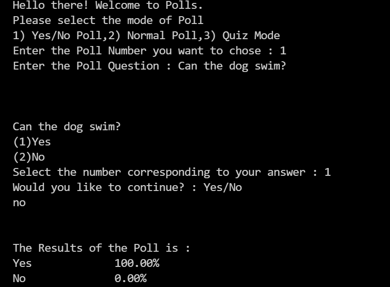
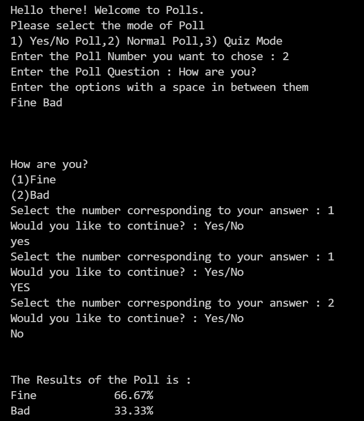
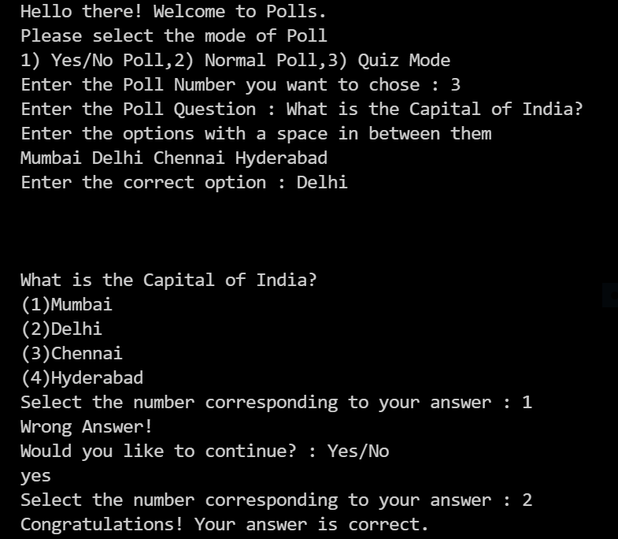

# Polls
This is a Compiler based Polls Application. It consists of three different types of Poll Modes in it.
## Yes/No Mode
  A Poll which supports Yes/No poll questions in it.
  

 
## Normal Mode
  A Noraml Poll which is used to assess the users opinion on the Poll Question.
  

  
## Quiz Mode
  A Quiz Poll in which there will be only one correct option in the available options.
 

